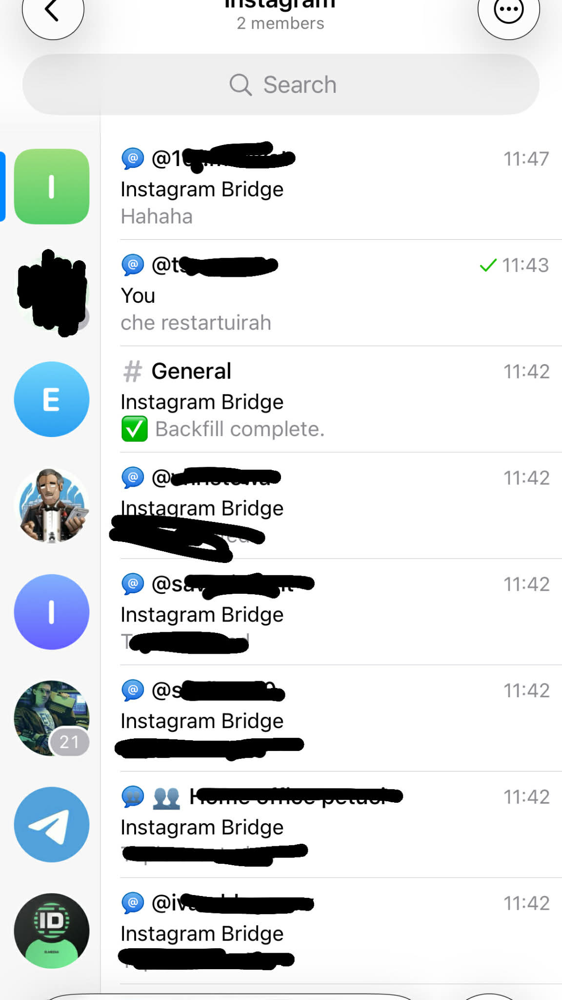

# ig2tg

**Bridge your Instagram DMs to Telegram.** One supergroup, auto-created topics per contact, bidirectional sync — text, photos, videos, and voice messages.

Built on top of the Instagram MQTT protocol (the same one the official app uses), so messages arrive in real time with no polling.

---

## How it works

```
Instagram ←→ MQTT ←→ ig2tg ←→ Telegram Bot API
                       ↕
                    SQLite
```

ig2tg connects to Instagram's realtime messaging protocol and bridges every DM conversation into a **Telegram forum topic** inside a single supergroup. When someone messages you on Instagram, a topic is automatically created with their username. When you reply in that topic, your message is sent back to Instagram. You can also keep using the Instagram app — messages you send from your phone sync to Telegram too.

<p align="center">
  
</p>

## Features

- **Bidirectional sync** — reply from Telegram or from the Instagram app, both sides stay in sync
- **Auto-created topics** — each Instagram contact gets their own forum topic, no manual setup
- **Media forwarding** — photos, videos, and voice messages work in both directions
- **Echo prevention** — smart deduplication ensures no infinite loops or duplicate messages
- **Session persistence** — survives restarts without re-authentication
- **Self-hosted** — runs on your machine or a VPS. Your credentials never leave your infrastructure

## Quickstart

### Prerequisites

- Node.js ≥ 20
- A personal Instagram account
- A Telegram bot token, supergroup with **Topics** enabled, and your user ID

### 1. Create a Telegram bot

1. Message **@BotFather** on Telegram → `/newbot`
2. Follow the prompts to pick a name and username
3. Copy the bot token (e.g. `123456:ABC-DEF1234ghIkl-zyx57W2v1u123ew11`)
4. **Disable privacy mode**: In BotFather → `/mybots` → select your bot → **Bot Settings** → **Group Privacy** → **Turn off**

   Without this, the bot can't read messages in topics, so TG→IG forwarding won't work.

### 2. Create a supergroup with Topics

1. Telegram → **New Group** → add at least one member (required by Telegram to create a group)
2. Open group settings → **Edit** → enable **Topics**
3. Add your bot as admin with these permissions:
   - **Manage Topics** — create/close/reopen topics
   - **Post Messages** — forward messages into topics
   - **Delete Messages** — auto-delete `/login` messages containing credentials

### 3. Get your IDs

| Value | How to get it |
|---|---|
| `bot_token` | From BotFather (step 1) |
| `supergroup_id` | Open your group in [web.telegram.org](https://web.telegram.org) — the number after `#` in the URL (e.g. `-1001234567890`) |
| `owner_id` | Message **@userinfobot** on Telegram — it replies with your user ID |

**Alternative for supergroup_id:** Add **@RawDataBot** to your supergroup — it will print the chat ID (starts with `-100`). Remove it after.

### 4. Configure

Set environment variables:

```bash
export TG_BOT_TOKEN="123456:ABC-DEF1234ghIkl-zyx57W2v1u123ew11"
export TG_SUPERGROUP_ID="-1001234567890"
export TG_OWNER_ID="123456789"
```

Or edit `config.yaml` directly with literal values instead of `${env:...}` references.

<details>
<summary>All config options</summary>

```yaml
telegram:
  bot_token: "${env:TG_BOT_TOKEN}"
  supergroup_id: "${env:TG_SUPERGROUP_ID}"
  owner_id: "${env:TG_OWNER_ID}"

bridge:
  db_path: "${env:BRIDGE_DB_PATH:-./data/bridge.sqlite}"
  media_timeout_ms: "${env:BRIDGE_MEDIA_TIMEOUT_MS:-15000}"
  backfill_on_start: "${env:BRIDGE_BACKFILL_ON_START:-true}"
  backfill_count: "${env:BRIDGE_BACKFILL_COUNT:-20}"
  topic_name_format: "${env:BRIDGE_TOPIC_NAME_FORMAT:-@{username}}"
  log_level: "${env:BRIDGE_LOG_LEVEL:-debug}"
```

</details>

### 5. Install and run

```bash
git clone https://github.com/GYovchev/ig2tg.git
cd ig2tg
npm install

# Development (tsx, no build step)
npm run dev

# Production (build first)
npm run build
npm start
```

### 6. Connect Instagram

Once the bot is running, open the supergroup's **General** topic and send:

```
/login your_ig_username your_ig_password
```

The message is auto-deleted for security. If 2FA is required, the bot will prompt you to send `/2fa <code>`.

This is a one-time step — the session persists across restarts.

### 7. Test

1. Send a DM to your Instagram account from another account
2. A new forum topic should appear in your supergroup
3. Reply in that topic — the message should arrive on Instagram

## Bot Commands

Type these in the supergroup's **General** topic:

| Command | Description |
|---|---|
| `/start` | Show greeting |
| `/help` | List available commands |
| `/login user pass` | Connect Instagram (message auto-deleted) |
| `/2fa <code>` | Complete two-factor authentication (message auto-deleted) |
| `/logout` | Disconnect Instagram and reset the bridge |
| `/status` | Bridge health, connection state, message count |
| `/reconnect` | Force-reconnect Instagram MQTT |
| `/sync` | Backfill recent threads |
| `/mute @user` | Stop forwarding from a contact |
| `/unmute @user` | Resume forwarding |
| `/contacts` | List all bridged contacts |
| `/cleanup` | Delete all topics and reset database (requires double confirmation) |

## Upstream

The Instagram client layer is derived from [instagram-cli](https://github.com/supreme-gg-gg/instagram-cli) by supreme-gg-gg.

## Deploying to Kubernetes

See [docs/k3s-deployment.md](docs/k3s-deployment.md) for a step-by-step guide to running ig2tg on a k3s cluster.

## Known Limitations

- **Personal accounts only** — uses Instagram's private API, not the official Graph API
- **Instagram may flag logins** — occasional challenges or session expiry may require re-authentication
- **Voice note conversion** — may require `ffmpeg` installed (Telegram uses OGG Opus, Instagram uses AAC)
- **No end-to-end encryption** — messages pass through your server in plaintext
- **Group DMs** — supported but experimental, messages are prefixed with sender names
- **No TG→IG replies or reactions** — message IDs are stored as SHA-256 hashes for privacy, so the bridge cannot map a Telegram message back to its Instagram original. Replying to a message in Telegram sends a new message (not a quote-reply) on Instagram. Reactions added in Telegram are not forwarded to Instagram. The reverse direction (IG→TG) works normally for both replies and reactions.

## License

MIT — see `THIRD_PARTY_LICENSES` for upstream attribution.
